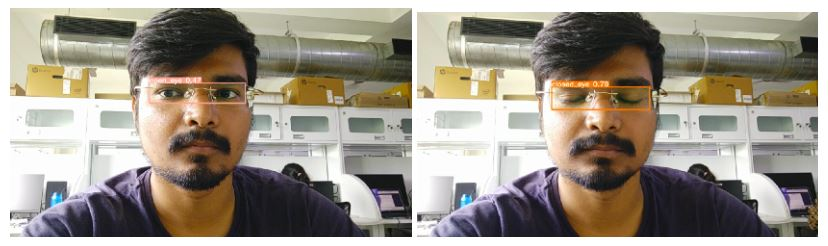
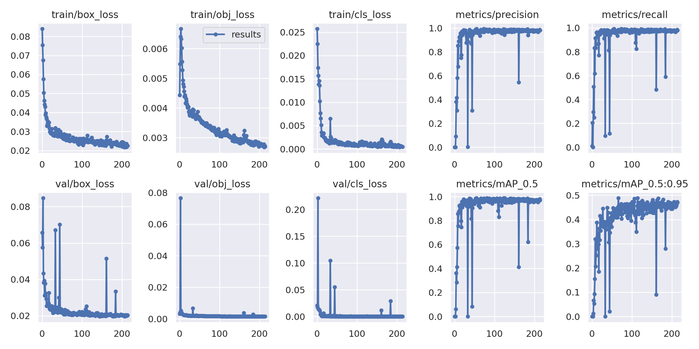

# MTech_Major_Project

Topic:- Driver Drowsiness Detection

There are several methods to detect a driver’s drowsiness. The one discussed here is driver drowsiness based on eye detection. For this, two methods are discussed here.
1. The first one is based on Haar Cascade features. In this, real time video is fed into the proposed algorithm. The algorithm first enhances each video frame using the technique ”LIME”. Then the face is detected and the eye portion is taken from it. The reason behind this is to reduce the complexity and time for eye detection. After that, for eye detection, the Haar Cascade Classifier is used here. After eye detection, the CNN model is used for classifying it into an open or close state and blink frequency/PERCLOS is calculated from it. It can tell whether a driver is in a drowsy state or not. 
2. The second one is based on the YoLov5 model. In this, detection of the eye and classification of the same into open eye and closed eye is happening under the same block. After that, blink frequency/PERCLOS is calculated to make the decision about a drowsy state.

For this project, I have used yolov5m (medium version for less space consumption and high speed but with little less accuracy) and yolov5l (large version of yolov5
for better accuracy) pre-trained model for training. These models are trained on COCO128 dataset which have total 80 classes. I trained the above pre-trained model on new custom data-set containing 2 classes. With total of 1336 training images ( 636 images from open eye class and 700 from closed eye class) and 414 validation images ( 220 images from open eye class and 194 from closed eye class), the model shows good accuracy (98.2% for yolov5m and 98.6% for yolov5l) with 300 epochs and 16 batches. For running it is taking average of 0.08sec per frame. Below is the image for training accuracy,loss and the result.
* The complete video is here:- shorturl.at/fnGV2

